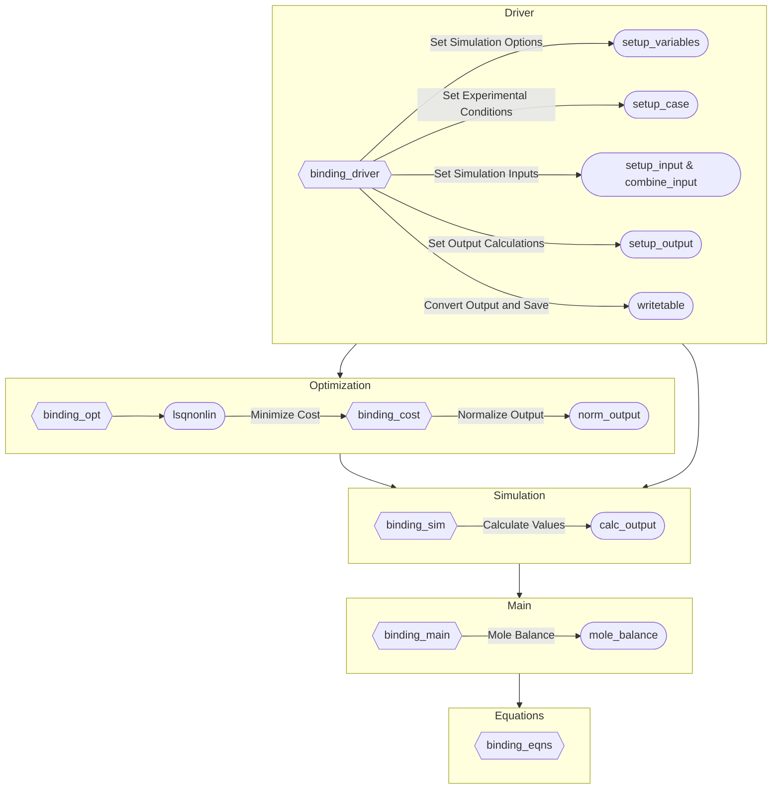

# IL6R/IL8R Antibody Binding Model Code

<!-- badges: start -->

<!-- badges: end -->

Christina M.P. Ray, Huilin Yang, Jamie B. Spangler, Feilim Mac Gabhann

This repository contains all code used in the article "Mechanistic computational modeling of monospecific and bispecific antibodies targeting interleukin-6/8 receptors". The model is comprised of a coupled set of ordinary differential equations (ODEs) where each individual ODE describes one molecule (antibody or receptor) or molecular complex (antibody + receptor). The terms in the ODEs represent each binding interaction (binding and unbinding processes) in the system.

## Software Requirements

* **MATLAB**: The ODE model and simulation scripts are written in MATLAB using version R2022a
    * *Statistics and Machine Learning Toolbox*: Uses `lhsdesign` to generate initial guesses for the parameter optimziation using Latin Hypercube Sampling; uses the `randsample` function to randomly sample a subset of simulation inputs when simulations are performed with the "Benchmark" option
    * *Optimization Toolbox*: Uses `lsqnonlin` for the non-linear least squares optimization to fit the parameter values to the experimental data
    * *Parallel Computing Toolbox*: Uses `parfor` to run multiple simulations in parallel
* **R**: Scripts for the analysis and visualization of the simulation results are written in R using version 4.2.2
    * *Packages used*: `cli`, `crthemes`, `ggh4x`, `ggthemes`, `here`, `palettes`, `patchwork`, `scales`, `sciscales`, `tidyverse`

## Folder Structure

Model code and output are organized into folders:

* **code**: MATLAB scripts for the models, helper functions, and R code for generating figures
    * **data_processing**: MATLAB functions used to import experimental data for parameter optimization; R functions used to import and clean simulation results for analysis and visualization
    * **figures**: R functions and scripts to generate the manuscript figures from the simulation results
    * **helpers**: MATLAB utility functions used in running the model simulations
    * **simulations**: ODE binding model equations and functions for solving the system of equations, optimizing parameters to experimental data, and running simulations using optimal parameter values
* **data**: Flow cytometry *in vitro* binding assay experimental data in CSV files
* **example**: Sample inputs for specific model functions
* **output**: `.mat` files with the input variables used for the simulations in the "Mechanistic computational modeling of monospecific and bispecific antibodies targeting interleukin-6/8 receptors" manuscript; files can be passed to the `binding_driver()` function to replicate the simulations in the article
    * **figures**: Figures included in the manuscript
    * Output `.csv` files from model simulations are available on Zenodo at http://doi.org/10.5281/zenodo.10393562
* **resources**: Files automatically generated by MATLAB for the MATLAB project

## How to Use

1. Download or clone the repository
2. Open `BindingModel.prj` in MATLAB or `Binding Model.Rproj` in RStudio
3. Open the desired model or plot file
    - Models are located in `code/simulations` and plotting code is located in `code/figures`
    - `binding_driver.m` (located in `code/simulations`) is used for running all of the model simulations
    - See [Model Structure](#model-structure) for more information
4. For functions, see the documentation at the top of the file for input and output arguments
5. For scripts, adjust file-specific options at the top of the code file as needed
6. Run

### Running with Sample Inputs

Sample inputs are provided for the `binding_sim()`, `binding_main()`, `binding_cost()`, `binding_opt()`, and `norm_output()` functions for the IL6R/IL8R antibody binding model. The MAT file containing the sample variables is located at `example/sample.mat` and is generated with the `generate_sample()` function. To run any of these functions with the sample inputs:

1. Download or clone the repository
2. Open `BindingModel.prj` in MATLAB
3. Run `load example/sample.mat` in the Command Window to load the sample variables in the workspace
4. Call any of the functions listed above using the variables in the workspace
    - The variables are saved with the same names as in the function definitions
    
The `generate_sample()` function is located in the `example` folder. It provides substantial infomation on the structure of all of the function inputs, how the function inputs are generated, why the functions are set up in a certain way, and how to use the model functions. The `binding_driver()` function in the `code/simulations` folder includes the variables and cases used for the simulations described in the manuscript.

The documentation for each function also provides information on different options available. The documentation for any of the model functions can be accessed with by running `help FUNCTION_NAME` in the Command Window at any time when the MATLAB project is loaded.

### MATLAB Project File

The MATLAB files for the project can be accessed through the `BindingModel.prj` MATLAB project file. Opening `BindingModel.prj` in MATLAB will add the project files and folders to the MATLAB search path, which allows the model files and helper functions to run correctly. It also enables the documentation for the model functions to be accessible with the `help` function.

### R Project File

The R files for the project can be accessed through the `Binding Model.Rproj` folder in RStudio or by opening and running the file outside of RStudio. The benefit of the project is that it keeps consistent settings between workspaces and stores metadata about the R code files.

The R packages used for styling the simulation figures can be installed from GitHub at [christyray/crthemes](https://github.com/christyray/crthemes) and [christyray/sciscales](https://github.com/christyray/sciscales).

## Model Structure

The general model layout is as follows:

* **Equations**: contains the differential equations that govern production, binding and unbinding, transport, internalization, and degradation of the species of the model
* **Main**: calls the ODE solver on the equations file with the parameters and conditions specified by the driver file, also completes a mole balance on the output
* **Simulation**: sets up the individual simulations to for the varying input values, gives input to the main file for the ODE solver, and calculates the desired output values from the simulation results
* **Driver**: determines which type of simulation or optimization should be performed; sets the species, parameters, initial conditions, and desired output; saves the simulation results
* **Cost**: used for optimization of parameters based on experimental data, output is the difference between the simulation and the experimental data which is then optimized by the solver in the optimization file
* **Optimization**: sets up the initial guesses, bounds, and options for the optimization solver and calls the optimization solver on the cost function

### Binding Model Diagram

### Specific Simulations

The `.mat` files in the `output` directory and the options in the `binding_driver()` function correspond to the simulations performed for the article "Mechanistic computational modeling of monospecific and bispecific antibodies targeting interleukin-6/8 receptors". The `.mat` files can be passed as input to `binding_driver()` to replicate the simulations used in the paper, or the `binding_driver()` function can be called with the `"Sim"` option and the name of a simulation to be run. Output `.csv` files from these model simulations are available on Zenodo at http://doi.org/10.5281/zenodo.10393562.

* `optimization`: Optimization of binding rate constants (association and dissociation) to experimental *in vitro* flow cytometry data; results displayed in Figure 2
* `binding-curve`: Model simulations using the best-fit parameter set for comparison to the experimental data used to fit the model parameters; results displayed in Figure 3
* `compare-opt`: Model simulations using each of the optimized parameter sets; results displayed in the Supplemental Information
* `time`: Simulations of antibody binding dynamics over time; results displayed in Figure 4
* `concentration`: Simulations with varying antibody concentrations and receptor expression levels; results displayed in Figure 5
* `monovalent`: Simulations restricted to monovalent antibody binding only; results displayed in Figure 6
* `compare-ab` and `compare-recep`: Simulations of both the bispecific antibody BS1 and the combination of monospecific antibodies tocilizumab and 10H2 for comparsion; results displayed in Figure 7
* `local` and `global`: Local and global univariate sensitivity analyses; results displayed in Figure 8
    
## References

> H. Yang, M. N. Karl, W. Wang, B. Starich, H. Tan, A. Kiemen, A. B. Pucsek, Y.-H. Kuo, G. C. Russo, T. Pan, E. M. Jaffee, E. J. Fertig, D. Wirtz, and J. B. Spangler. Engineered bispecific antibodies targeting the interleukin-6 and -8 receptors potently inhibit cancer cell migration and tumor metastasis. Molecular Therapy, 30(11):3430–3449, Nov. 2022. doi:[10.1016/j.ymthe.2022.07.008](https://doi.org/10.1016/j.ymthe.2022.07.008)
